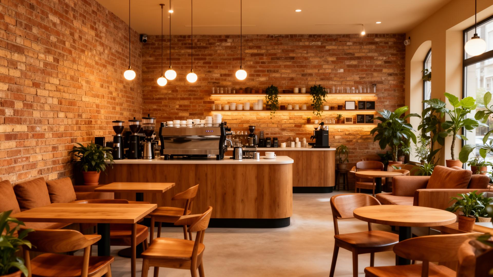

# ☕ Enso Coffee



<div align="center">

[](https://enso.coffee)
[](https://react.dev)
[](https://www.typescriptlang.org/)
[](https://tailwindcss.com)
[](#-license)

**A digital sanctuary for Katargam's premier specialty coffee house.** *Crafted brews. Cozy vibes. Modern code.*

[**View Live Demo**](https://ensocoffee.vercel.app/) · [**Report Bug**](https://github.com/ds-labs-op/enso-coffee/issues) · [**Request Feature**](https://github.com/ds-labs-op/enso-coffee/issues)

</div>

---

## 📌 Overview

**Enso Coffee** is more than just a landing page; it's a digital reflection of the café's soul. Designed to mirror the physical space's warmth and serenity, this project serves as the primary touchpoint for customers in Surat.

Built with a focus on **Local SEO** and **Performance**, it ensures that whether a user is looking for a "Cold Brew Barrel" or a "Work-friendly cafe in Katargam," Enso is their first discovery.

---

## 🚀 Key Features

### 🎨 **Experience & UI**
- **Atmospheric Design:** A warm, inviting UI that uses earthy tones to match the café's interior.
- **Scroll Animations:** Integrated **AOS (Animate On Scroll)** for a cinematic reveal of content.
- **Responsive Layout:** Fully optimized for mobile discovery, ensuring the menu looks delicious on any screen size.

### ⚡ **Performance & Engineering**
- **Vite-Powered:** Blazing fast development server and optimized production builds.
- **Type-Safe:** Built with **TypeScript** for reliability and easier refactoring.
- **SEO Optimized:** Implements `react-helmet-async` with structured **JSON-LD Schema** (LocalBusiness) for rich Google snippets.

### 🛒 **Business Logic**
- **Digital Menu:** Interactive showcase of signature items like Vietnamese Coffee, Affogato, and Cheesecake.
- **Social Integration:** Live Instagram feed integration to showcase the latest community moments.
- **Location Intelligence:** Integrated Google Maps and direct "Call for Booking" CTAs.

---

## 🛠️ Tech Stack

This project uses a modern, opinionated stack focused on developer experience and end-user performance.

| Category | Technologies |
| :--- | :--- |
| **Core** | React 18, TypeScript, Vite |
| **Styling** | Tailwind CSS, Tailwind Merge, CLSX, Lucide React |
| **UI Components** | **Shadcn/UI** (Radix Primitives), Toast (Sonner) |
| **Animation** | AOS (Animate On Scroll), Tailwind Animate |
| **State & Data** | TanStack Query (React Query) |
| **Forms & Validation** | React Hook Form, Zod |
| **Routing & SEO** | React Router DOM, React Helmet Async |

---

## 📂 Project Structure

A scalable folder structure designed for feature-based growth.

```bash
src/
├── assets/          # Static assets (hero images, menu PDFs)
├── components/      # Modular UI components
│   ├── ui/          # Reusable primitives (Shadcn - Buttons, Accordions)
│   ├── Hero.tsx     # Landing hero section
│   ├── About.tsx    # Story and features section
│   └── Menu.tsx     # Menu showcase logic
├── hooks/           # Custom React hooks (use-mobile, use-toast)
├── lib/             # Utilities (cn, formatters)
├── pages/           # Route views (Index, Menu, Contact)
└── main.tsx         # Entry point

```

---

## ⚙️ Local Development

Follow these steps to get the café running on your local machine.

### Prerequisites
* Node.js (v18+)
* npm or bun

### Installation

1. **Clone the repository**

```bash
git clone [https://github.com/ds-labs-op/enso-coffee.git](https://github.com/ds-labs-op/enso-coffee.git)
cd enso-coffee

```

2. **Install dependencies**

```bash
npm install
# or
bun install

```

3. **Start the development server**

```bash
npm run dev

```

4. **Build for production**

```bash
npm run build

```

---

## 🤝 Contributing

Contributions are what make the open-source community such an amazing place to learn, inspire, and create. Any contributions you make are **greatly appreciated**.

1. Fork the Project
2. Create your Feature Branch (`git checkout -b feature/AmazingFeature`)
3. Commit your Changes (`git commit -m 'Add some AmazingFeature'`)
4. Push to the Branch (`git push origin feature/AmazingFeature`)
5. Open a Pull Request

---

## 👤 Author **Sahaj & Divy** - *Full-Stack Developer & Builder*

* **GitHub:** [sahaj33-op](https://www.google.com/search?q=https://github.com/sahaj33-op)
* **GitHub:** [divyviradiya1501](https://www.google.com/search?q=https://github.com/divyviradiya1501)
* **Portfolio:** [sahaj33.vercel.app](https://sahaj33.vercel.app/)

---

## 📄 License

Distributed under the MIT License. See `LICENSE` for more information.

<div align="center">
<sub>Built with 💙 and ☕ in Surat, India.</sub>
</div>
